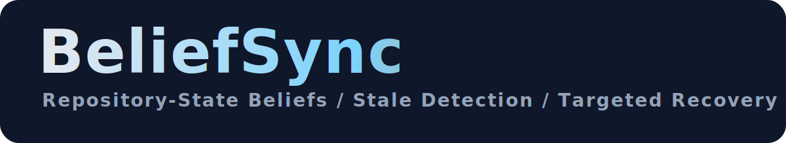

<table align="center">
  <tr>
    <td align="center" valign="middle" width="180">
      
    </td>
    <td align="left" valign="middle">
      
    </td>
  </tr>
</table>

<p align="center">
  
</p>

<p align="center">
  <strong>English</strong> | <a href="./README.zh-CN.md">ZH-CN</a>
</p>

<p align="center">
  <strong>🧠 BeliefSync gives coding agents a repository-state sync layer:</strong>
  explicit beliefs, stale-belief detection, targeted revalidation, git-aware scans, and reportable recovery state.
</p>

<p align="center">
  <strong>⚙️ Build with the project:</strong> make coding agents more inspectable, more stable in dynamic repositories, and less dependent on brute-force context rescans.
</p>

<p align="center">
  <a href="#quick-start"></a>
  <a href="#beliefsync-architecture"></a>
  <a href="#workspace-workflow"></a>
  <a href="#kimi-openai-compatible"></a>
  <a href="#commands-surface"></a>
  <a href="./LICENSE"></a>
</p>

<p align="center">
  
  
  
  
  
  
  
  
  
  
</p>

<a id="why-beliefsync"></a>
## Why BeliefSync 🧠✨

Coding agents are already good at producing patches in static snapshots.  
They are much worse at one quieter but much more realistic failure mode 👀

- 🔁 a commit lands while the agent is still reasoning from an older snapshot
- 🧪 a test changes what “correct” means
- 💬 an issue comment narrows the requirement
- 📦 a dependency update invalidates an earlier hypothesis

Most stacks answer that problem by rescanning more repository context 😵

BeliefSync takes a different view:

> the problem is not only missing context, but stale repository beliefs.

So instead of hiding state inside prompt history, BeliefSync:

- 🧩 turns working assumptions into explicit repository-state beliefs
- 📎 attaches evidence, scope, and version validity to each belief
- 🚨 detects which beliefs likely became stale after repository events
- 🎯 recommends low-cost revalidation actions before the agent keeps editing code

This makes BeliefSync useful as:

- 🛡️ a reliability layer for coding agents
- 🔍 a debugging and observability tool for agent runs
- 🧪 a project-first foundation for stale-belief research in software engineering agents

---

<a id="beliefsync-architecture"></a>
## BeliefSync Architecture 🧩🛠️

<div align="center">
  
</div>

<p align="center">
  <strong>🔄 Repository events become explicit beliefs, stale assessments, and targeted recovery actions.</strong>
</p>

BeliefSync is built around one architectural bet 🧠

> coding agents need an explicit repository-state layer, not just longer prompt history.

The runtime core is intentionally simple and visible:

- `Belief Constructor` 🧠
  - extracts candidate beliefs from issue text, test logs, and repository context
- `Belief Store` 🗂️
  - persists repository-state claims with scope, evidence, and version metadata
- `Stale Belief Detector` 🚨
  - scores which beliefs likely drifted after repository changes
- `Revalidation Planner` 🎯
  - converts stale beliefs into low-cost, high-value recovery actions
- `Task Agent Adapter` 🤖
  - feeds the cleaned state back into a coding-agent loop

The design is deliberately:

- `agent-agnostic` 🔌
  - BeliefSync can sit beside different coding-agent runtimes
- `inspectable` 👀
  - beliefs are stored as explicit JSON, not hidden in opaque traces
- `project-first, research-ready` 🧪
  - useful as an open-source reliability tool while still structured enough for benchmark and paper work later

---

<a id="quick-start"></a>
## Quick Start 🚀

### What You Need 🧰

| Item | Why It Matters |
| --- | --- |
| `Python 3.10+` | required for the CLI, belief models, reports, and repository scanning |
| `git` | used for repository-event ingestion and refresh workflows |
| optional OpenAI-compatible provider | used for `llm-smoke-test` and `llm-extract` |

### 1. Clone and Install 📦

```bash
git clone https://github.com/xiao-zi-chen/Beliefsync.git
cd Beliefsync
python -m pip install -e .
```

### 2. Run the Built-In Demo ▶️

```bash
python -m beliefsync demo
```

### 3. Initialize a Workspace 🏗️

```bash
python -m beliefsync init --repo-id demo/repo
python -m beliefsync status
python -m beliefsync show-config
```

### 4. Create a Baseline Snapshot 📸

```bash
python -m beliefsync snapshot ^
  --repo-id demo/repo ^
  --repo-path . ^
  --issue-file examples/demo_issue.md ^
  --test-log examples/demo_test_log.txt
```

### 5. Scan Repository Changes 🔍

```bash
python -m beliefsync scan ^
  --repo-id demo/repo ^
  --repo-path . ^
  --issue-file examples/demo_issue.md ^
  --test-log examples/demo_test_log.txt ^
  --base-ref HEAD~1 ^
  --head-ref HEAD
```

### 6. Refresh from the Last Snapshot 🔄

```bash
python -m beliefsync refresh ^
  --repo-path . ^
  --head-ref HEAD ^
  --format markdown
```

---

<a id="workspace-workflow"></a>
## Workspace Workflow 🗺️🔁

BeliefSync is not just a one-shot CLI. It now supports a small but real workspace lifecycle ✨

### Baseline Loop

1. `beliefsync init` 🏗️
   - create `.beliefsync/`
2. `beliefsync snapshot` 📸
   - store the current belief baseline
3. repository changes happen 🔁
4. `beliefsync refresh` 🚨
   - compare the last belief baseline against new repository events
5. BeliefSync emits:
   - stale-belief assessments
   - targeted revalidation actions
   - text / JSON / Markdown / HTML reports
6. the refreshed beliefs become the next baseline ♻️

### Why This Matters

That workflow makes BeliefSync feel like a practical tool rather than a one-off demo:

- 🧠 you can keep a local belief baseline in `.beliefsync/beliefs.json`
- 🧾 you can inspect workspace state via `.beliefsync/state.json`
- 📚 you can keep report history under `.beliefsync/reports/`

This is the shape of a real “agent reliability sidecar,” not just a benchmark script 💡

---

<a id="kimi-openai-compatible"></a>
## Kimi / OpenAI-Compatible Support 🌙🤝

BeliefSync already supports OpenAI-compatible LLM access, including Kimi-compatible usage ✅

### Supported Env Vars 🔑

Generic:

- `BELIEFSYNC_LLM_API_KEY`
- `BELIEFSYNC_LLM_BASE_URL`
- `BELIEFSYNC_LLM_MODEL`
- `BELIEFSYNC_LLM_TIMEOUT`

Kimi aliases:

- `KIMI_API_KEY`
- `KIMI_BASE_URL`
- `KIMI_MODEL`

You can start from [`.env.example`](./.env.example).

### Smoke Test the Connection 🧪

```bash
python -m beliefsync llm-smoke-test
```

This command:

- 📋 lists available models from the provider
- ⚡ performs a tiny completion request
- 🔁 retries on transient overload
- 🧭 falls back to reasonable OpenAI-compatible model choices when possible

### Use an LLM to Extract Beliefs 🧠

```bash
python -m beliefsync llm-extract ^
  --repo-id demo/repo ^
  --issue-file examples/demo_issue.md ^
  --test-log examples/demo_test_log.txt ^
  --output .beliefsync/llm_beliefs.json
```

This is useful when you want richer candidate beliefs than the purely heuristic extractor.

---

<a id="commands-surface"></a>
## Commands Surface 🎛️

BeliefSync currently exposes **16 CLI commands**:

| Command | Purpose |
| --- | --- |
| `init` | initialize a `.beliefsync/` workspace |
| `status` | inspect workspace state |
| `show-config` | print the active config |
| `snapshot` | create a baseline belief snapshot |
| `refresh` | re-run stale-belief analysis against new repository changes |
| `llm-smoke-test` | test OpenAI-compatible/Kimi connectivity |
| `llm-extract` | extract candidate beliefs with an LLM |
| `demo` | run the built-in end-to-end example |
| `extract` | heuristic belief extraction |
| `detect` | stale-belief detection |
| `plan` | targeted revalidation planning |
| `report` | produce text / JSON / Markdown / HTML reports |
| `ingest-git` | turn a git diff into repository events |
| `scan` | run extract + ingest + report in one workflow |
| `validate-beliefs` | validate belief JSON files |
| `validate-events` | validate event JSON files |

This is enough to make the repository immediately useful for:

- 🧪 local developer experiments
- 🤖 coding-agent wrappers
- 🧾 report-first debugging workflows
- 🔌 future adapter work with OpenHands or SWE-agent

---

## Project Surface 📡

BeliefSync is compact on purpose, but it already has a meaningful open-source surface:

| Surface | Count | What It Gives You |
| --- | --- | --- |
| CLI commands | **16** | end-to-end workflows, validation, LLM integration |
| belief types | **5** | bug localization, API contract, test expectation, requirement, dependency |
| report formats | **4** | `text`, `json`, `markdown`, `html` |
| adapters | **2** | OpenHands and SWE-agent placeholders for future integration |
| tests | **13** | baseline regression coverage |
| runtime dependencies | **0** | standard-library-first baseline |

That combination is a big part of the project’s identity:

- 🧱 serious enough to be useful
- 👀 simple enough to inspect
- 🌱 structured enough to extend

---

## Project Layout 🗂️

```text
Beliefsync/
  .github/
    assets/
    workflows/
  docs/
  examples/
  src/beliefsync/
  tests/
  README.md
  README.zh-CN.md
  pyproject.toml
```

Important paths:

- [docs/architecture.md](./docs/architecture.md)
- [docs/integration.md](./docs/integration.md)
- [docs/cli.md](./docs/cli.md)
- [docs/belief_model.md](./docs/belief_model.md)
- [ROADMAP.md](./ROADMAP.md)
- [CHANGELOG.md](./CHANGELOG.md)

---

## Roadmap Direction 🛣️

The next steps are not “make the README prettier again.”  
They are product and integration steps:

- 🧬 richer symbol-level scope extraction
- 🪝 better git-native event parsing
- 🧠 learned stale-belief detectors
- 🤝 OpenHands and SWE-agent integration
- ⏱️ watch / hook driven workflows
- 📊 richer dashboards for belief drift and recovery actions

BeliefSync should grow into:

> a real reliability layer for coding agents operating in changing repositories.

---

## Contributing 🌱

If you want to help, the most valuable contributions right now are:

- 🧾 real repository traces
- 🚨 stale-belief failure cases
- 🧩 better event parsers
- 🎨 stronger report UX
- 🔌 coding-agent integrations

See [CONTRIBUTING.md](./CONTRIBUTING.md), [SECURITY.md](./SECURITY.md), and [CODE_OF_CONDUCT.md](./CODE_OF_CONDUCT.md).

---

## License 📄

MIT. See [LICENSE](./LICENSE).
