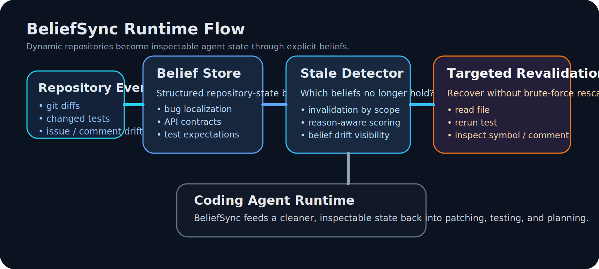

<table align="center">
  <tr>
    <td align="center" valign="middle" width="180">
      
    </td>
    <td align="left" valign="middle">
      
    </td>
  </tr>
</table>

<p align="center">
  
</p>

<p align="center">
  <a href="./README.md">English</a> | <strong>ZH-CN</strong>
</p>

<p align="center">
  <strong>BeliefSync 是一个给 coding agent 用的仓库状态同步层：</strong>
  把隐式假设变成显式 beliefs，检测哪些 beliefs 过期，并给出定向恢复动作。
</p>

<p align="center">
  <a href="#快速开始"></a>
  <a href="#架构"></a>
  <a href="#workspace-工作流"></a>
  <a href="#kimi--openai-compatible-支持"></a>
  <a href="./LICENSE"></a>
</p>

## 这个项目是做什么的

BeliefSync 的核心目标不是“让 agent 读更多上下文”，而是：

> 让 agent 明确知道自己当前相信仓库里的哪些事实，以及这些判断在仓库变化后是否已经失效。

它主要解决的场景包括：

- agent 还在按旧 commit 的理解继续改代码
- test 已经变化，但 agent 还沿用旧测试语义
- issue/comment 加了新约束，但 agent 还没同步
- dependency 更新后，旧推理链已经不成立

BeliefSync 会做 4 件事：

1. 提取 repository-state beliefs
2. 给 belief 绑定 scope、evidence、version validity
3. 检测哪些 belief stale 了
4. 推荐最值得执行的 targeted revalidation 动作

---

## 架构

<div align="center">
  
</div>

BeliefSync 的运行链路很清楚：

- `Repository Events`
  - git diff、test 变化、issue / comment 更新
- `Belief Store`
  - 存储 agent 当前对仓库状态的结构化判断
- `Stale Detector`
  - 判断哪些 belief 可能失效
- `Targeted Revalidation`
  - 生成更低成本的恢复动作
- `Task Agent`
  - 把清理过的状态再喂回 coding workflow

---

## 快速开始

```bash
git clone https://github.com/xiao-zi-chen/Beliefsync.git
cd Beliefsync
python -m pip install -e .
python -m beliefsync demo
```

常用工作流：

```bash
python -m beliefsync init --repo-id demo/repo
python -m beliefsync snapshot --repo-id demo/repo --repo-path . --issue-file examples/demo_issue.md --test-log examples/demo_test_log.txt
python -m beliefsync refresh --repo-path . --head-ref HEAD --format markdown
```

---

## Workspace 工作流

BeliefSync 现在已经不是一次性 demo 脚本，而是有持续工作流的工具：

1. `init`
   - 初始化 `.beliefsync/`
2. `snapshot`
   - 记录当前 belief baseline
3. 仓库变化
4. `refresh`
   - 基于新的 repository events 做 stale-belief 分析
5. 输出：
   - text / json / markdown / html 报告
6. 更新 baseline，供下一轮继续用

---

## Kimi / OpenAI-Compatible 支持

BeliefSync 已经支持 OpenAI-compatible 接口，也已经支持 Kimi 兼容接入。

环境变量支持：

- 通用：
  - `BELIEFSYNC_LLM_API_KEY`
  - `BELIEFSYNC_LLM_BASE_URL`
  - `BELIEFSYNC_LLM_MODEL`
- Kimi 别名：
  - `KIMI_API_KEY`
  - `KIMI_BASE_URL`
  - `KIMI_MODEL`

可以从 [`.env.example`](./.env.example) 开始。

常用命令：

```bash
python -m beliefsync llm-smoke-test
python -m beliefsync llm-extract --repo-id demo/repo --issue-file examples/demo_issue.md --test-log examples/demo_test_log.txt --output .beliefsync/llm_beliefs.json
```

---

## 当前项目面

目前仓库已经有：

- `16` 个 CLI commands
- `5` 类 belief types
- `4` 种报告格式
- `2` 个 adapter skeleton
- `13` 个测试
- `0` 个运行时第三方依赖

所以它现在已经不是一个空壳 repo，而是一版可以真实演示和继续扩展的开源项目。

---

## 文档入口

- [README.md](./README.md)
- [docs/architecture.md](./docs/architecture.md)
- [docs/integration.md](./docs/integration.md)
- [docs/cli.md](./docs/cli.md)
- [docs/belief_model.md](./docs/belief_model.md)
- [ROADMAP.md](./ROADMAP.md)

---

## 许可证

MIT，见 [LICENSE](./LICENSE)。
